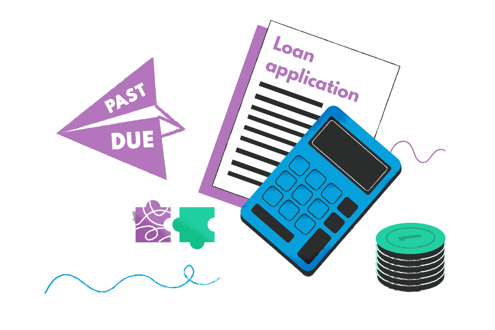
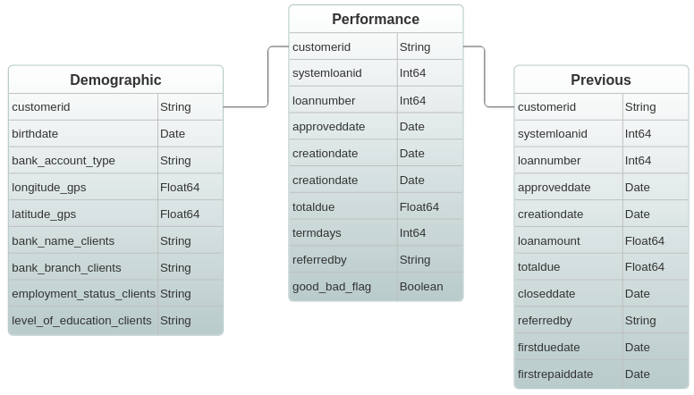
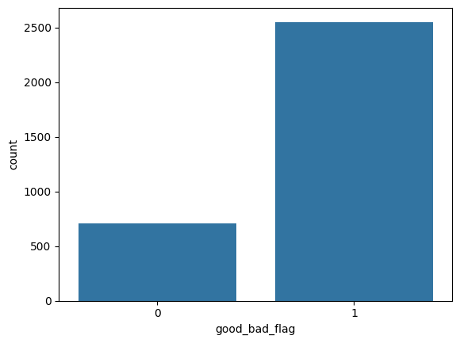
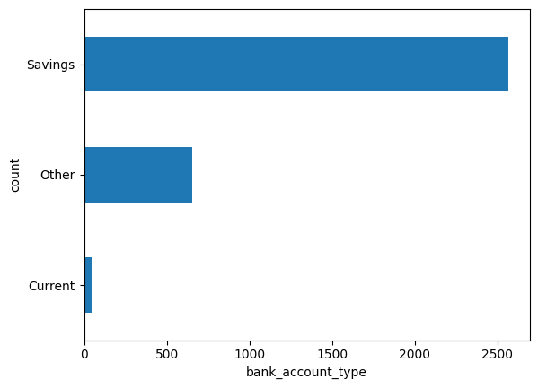
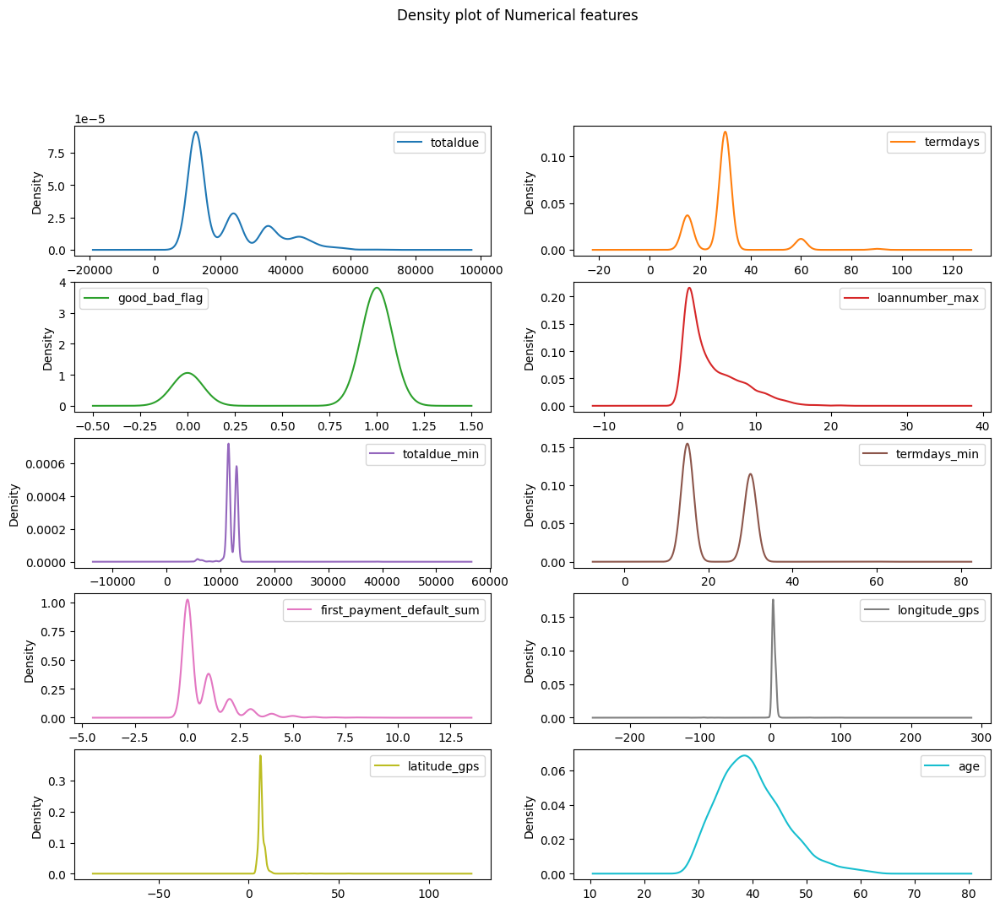
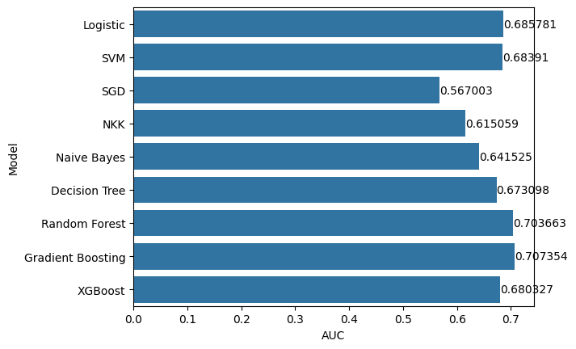
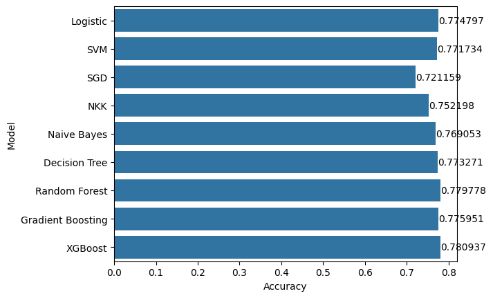
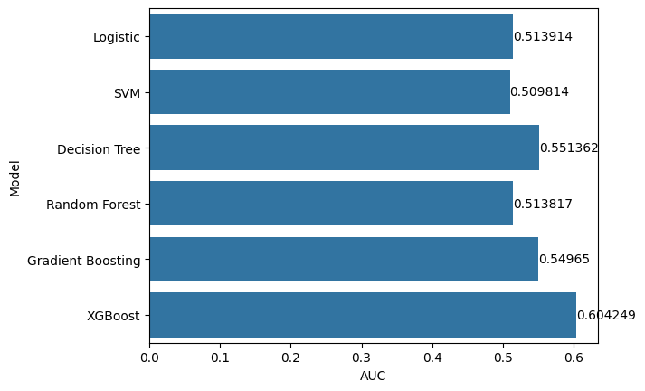
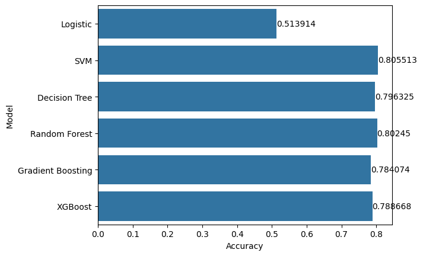

# Loan Default Prediction

<p align="center">
  
</p>

[](https://www.python.org/downloads)
[](https://www.docker.com)
[](https://streamlit.io/)
[](https://opensource.org/licenses/MIT)

## Table of Contents
- [Overview](#overview)
- [Data Source](#data-source)
- [Data Preprocessing](#data-preprocessing)
- [Exploratory Data Analysis](#exploratory-data-analysis)
- [Model Selection](#model-selection)
- [Technical Architecture](#technical-architecture)
- [Deployment](#deployment)
- [Contributing](#contributing)
- [Acknowledgements](#acknowledgements)
- [License](#license)
- [Contact](#contact)

## Overview

**Problem Statement:**  
Financial institutions face risks when granting personal loans, as there is always a possibility of default. This project aims to develop a machine learning model to predict loan default likelihood, enabling banks to make more informed lending decisions. The dataset includes customers' demographic details, previous loan history, and information on their repeat loans, for which we need to predict performance.

The project involves key steps such as *data preprocessing*, *feature engineering*, *exploratory data analysis (EDA)*, *feature selection*, and *model selection*. Various classification models are implemented and optimized to identify the most suitable approach for accurate and reliable loan default prediction.

**Usecases:**  
Banks and financial institutions rely on credit risk assessment to determine borrowers' likelihood of defaulting on a loan. An inaccurate assessment can lead to significant financial losses or missed lending opportunities. This project provides a **machine learning-based loan default prediction system** that helps lenders make data-driven decisions. By analyzing customer demographics, loan history, and repeat loan behaviours, the model identifies high-risk borrowers, enabling banks to take **proactive measures** such as adjusting interest rates, requiring additional guarantees, or rejecting risky applications. This improves **risk management, enhances financial stability, and ensures fairer lending practices**, benefiting both financial institutions and borrowers.

## Data Source
The datasets used in this project are from Zindi's [Loan Default Prediction Challenge](https://zindi.africa/competitions/data-science-nigeria-challenge-1-loan-default-prediction/data), publicly available on [Zindi](https://zindi.africa/) and in the ```Data``` folder of this project. Three datasets will be used: *demographic*, *previous loans*, and *performance* data. The features in each dataset are shown in the ER diagram below. Note that all the datasets can be joined using the ```customerid``` feature.

<p align="center">
  
</p>

## Data Preprocessing
Given three separate datasets, the first step was merging, unifying, and creating a single dataset for building the loan default prediction model. This involved:
- dealing with missing values and changing data types,
- engineering new features,
- aggregating certain features such as the number of loans, amount due, and loan term for each customer and,
- finally, all three datasets are merged by ```customerid```.
  
The first part (*Data Ingestion*) of the ```notebook.ipynb``` notebook  focuses on data preprocessing.

## Exploratory Data Analysis
Once the dataset is in good shape, the next step is EDA to ensure the quality of the data and extract preliminary insights into the problem. Below are plots that convey some insights from the EDA.
<div align="center">
	
	
</div>

<div align="center">
  
</div>


### EDA Observations:
- There is a class imbalance, with the majority(76%) of the instances in the dataset being good while a minority(24%) is bad.
- With the class imbalance, metrics like AUC, recall, and F1 are more suitable.
- Most loans are low amounts (10,000 naira) and for 30 days.
- The distribution of most of the features is not Gaussian (age is the closest to having a Gaussian distribution).
- For the categorical variables:
    - Most applicants have savings(64%) accounts, a permanent employment(68%) and are from GT bank(37%).
 
The second part (*Exploratory Data Analysis*) of the ```notebook.ipynb``` notebook  focuses on EDA.

## Model Selection
For this project, nine regression algorithms were compared before selecting a final one. They are:
- Logistic regression with lasso regularization
- Support vector machine
- Stochastic gradient descent
- KNearest Neighbour
- Naive Bayes
- Decision Tree
- Random Forest
- Gradient Boosting
- XGBoost
  
### Test
<div align="center">
	
	
</div>

### Validation
<div align="center">
	
	
</div>

Based on the AUC and Accuracy scores, the XGBoost Classifier was the best-performing algorithm selected to build the final model. The code for the model selection is available in ```notebook.ipynb``` under the *Model Selection* section.
    
## Model Information

- **Algorithm**: XGBoost Classifier
- **Features**: 
- **Target Variable**: 
- **Model Performance**: 

## Dependencies

- Python 3.11
- scikit-learn
- numpy
- pandas
- Streamlit

## Contributing

I welcome contributions to the Loan Default Application project! Here's how you can help:

1. Fork the repository
2. Create a new branch (`git checkout -b feature/AmazingFeature`)
3. Make your changes
4. Commit your changes (`git commit -m 'Add some AmazingFeature'`)
5. Push to the branch (`git push origin feature/AmazingFeature`)
6. Open a Pull Request

Please ensure your code adheres to the project's coding standards and includes appropriate tests.

## Acknowledgements

Special thanks to the Datatalks club for providing a practical and free course on Machine Learning. Gratitude to Alexey and the entire team for their efforts.

## License

This project is licensed under the MIT License - see the [LICENSE](https://opensource.org/license/mit) file for details.


## Contact
- LinkedIn: [Uchechukwu Njoku](https://www.linkedin.com/in/funjoku/)
